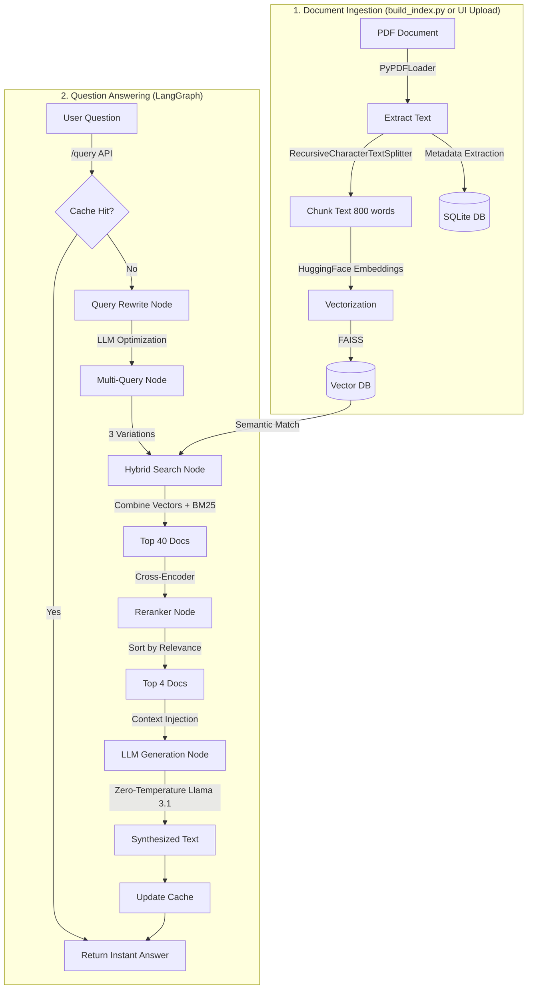

# Production Hybrid RAG System

A production-ready Retrieval-Augmented Generation (RAG) system built with FastAPI, LangGraph, and FAISS. This system processes PDF documents, stores their semantic embeddings locally, and uses a Large Language Model (Llama 3.1) to answer questions specifically based on the provided documents.

## 🏗️ Architecture & Workflow

The system is built on an asynchronous, highly-concurrent architecture to handle high traffic and prevent query bottlenecks. 

### High-Level Workflow


## 🧠 Step-by-Step Breakdown

### Phase 1: Creating the Vector DB (Initial Setup)
When you place a PDF in the `data/documents/` folder and run `python build_index.py`:
1. **Loading**: The system reads the raw PDF text.
2. **Chunking**: The text is chopped into smaller chunks (800 characters) so the AI can read specific paragraphs rather than the whole book at once.
3. **Embedding**: The `all-MiniLM-L6-v2` model converts those English words into an array of mathematical numbers (Vectors) that represent the "meaning" of the sentence.
4. **Storage**: It saves these numbers to a local `FAISS` index (`vector_store/` folder) so it never has to recalculate them again.

### Phase 2: Uploading a New File Live (`/upload_document`)
If your server is already running and a user uploads a new PDF via the API:
1. The file is saved to `data/uploads/`.
2. A FastAPI **Background Task** is instantly triggered. The user gets a "Success" message immediately while the heavy processing runs invisibly behind the scenes.
3. The new PDF goes through the exact same Chunking and Embedding process.
4. The system securely `merges` the new vectors into the live FAISS database in memory without skipping a beat or requiring a server restart!

### Phase 3: The Query Pipeline (Asking a Question)
When you send a question to the `/query` endpoint:
1. **Cache Check**: The system checks local memory (`cache.py`) to see if this question was asked recently. If yes, it returns it instantly (0.01s).
2. **Rewrite & Multi-Query**: The AI rewrites your question to ensure it's grammatically perfect for searching, then expands it into 3 different phrased variations to cast a wide net.
3. **Hybrid Retrieval**: It asks the FAISS database for paragraphs that mathematically match the meaning of the vectors, AND it uses `BM25` to find paragraphs that match the exact keywords. It grabs 40 paragraphs total.
4. **Reranking**: A specialized HuggingFace AI (`ms-marco`) reads those 40 paragraphs and harshly grades them on how well they actually answer your question. It deletes the bad ones and keeps only the absolute best **Top 4**.
5. **Generation**: The Top 4 paragraphs are sent directly to the **Llama-3.1** Groq API. The LLM is forced under strict instructions (`temperature=0.0`) to read ONLY those 4 paragraphs and synthesize the final answer. If the answer isn't in those paragraphs, it is strictly forbidden from guessing, preventing AI Hallucinations.

## 🚀 How to Run

### Start the Server
```bash
uvicorn app.main:app --reload
```
*Note: Due to our production optimizations, the HuggingFace AI models are preloaded securely into your RAM the moment the server starts, preventing horrible 15-second lag spikes on the first user query!*

### Run the Tests
To ensure you haven't broken the API logic before deploying to GitHub, run the Pytest suite:
```bash
pytest tests/test_api.py -v
```
*(The `pytest.ini` file guarantees that it will perfectly locate your modules without throwing `ModuleNotFoundError`).*

## ✨ Additional Features

- **GitHub CI/CD Automation**: Every time you push to the `main` branch, `.github/workflows/ci.yml` spins up a cloud Ubuntu server, installs your code, and automatically runs your pytest suite to guarantee code stability.
- **Deep Timing Metrics**: The JSON response of the `/query` endpoint includes a `timing` block that tracks exactly how many milliseconds the Rewrite, Retrieval, Rerank, and Generation phases took, allowing precise bottleneck monitoring.
- **SQLite Thread Safety**: Uploading massive files and searching heavily at the same time uses thread-safe Context Managers so the database never locks.
